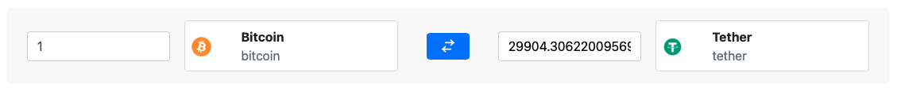

# Crypto Converter

A web based cryptocurrencies exchange rate calculator powered by [CoinGecko](https://www.coingecko.com/en/api).  
Second version of [rails-crypto-converter](https://github.com/WeiSin99/rails-crypto-converter), built using Vanilla JavaScript.

## Tech Stack

- JavaScript
- HTML
- CSS
- Webpack

## System Dependencies

- Git
- NodeJS

## Project Setup

1. Make sure you are in the project directory.
2. Run `npm install` to install dependencies.
3. Run `npm run dev` to start a development server on [http://localhost:8080/](http://localhost:8080/)

## Project Feature

1. **Search for a cryptocurrency**

- Search from over 10000 cryptocurrencies.
- Once selected a cryptocurrency, the exchange rate will change accordingly.

2. **Swap currencies**

- Click the swap button between two currencies to swap their position.
- Exchange rate will change immediately after the swap.
